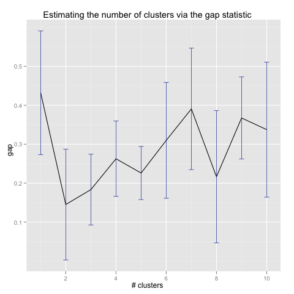
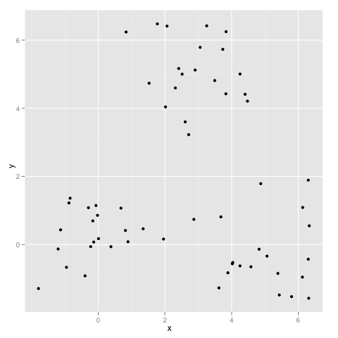
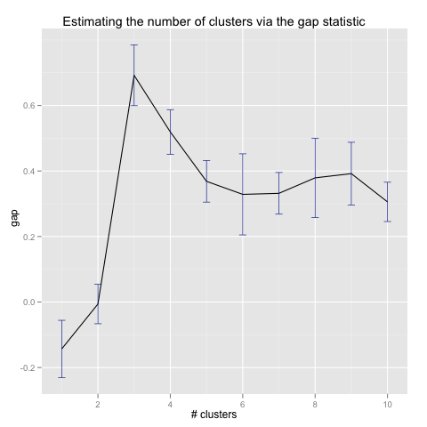
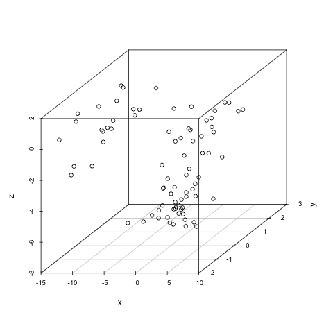

# About

An implementation of the gap statistic algorithm from Tibshirani, Walther, and Hastie's "Estimating the number of clusters in a data set via the gap statistic".

# Examples

		# Single cluster in 5 dimensions
		data = cbind(rnorm(20), rnorm(20), rnorm(20), rnorm(20), rnorm(20))

		png("examples/1_cluster_5d_gaps.png")
		gap_statistic(data)
		dev.off()
		

		# Three clusters in 2 dimensions
		x = c(rnorm(20, mean = 0), rnorm(20, mean = 3), rnorm(20, mean = 5))
		y = c(rnorm(20, mean = 0), rnorm(20, mean = 5), rnorm(20, mean = 0))
		data = cbind(x, y)

		png("examples/3_clusters_2d.png")
		qplot(x, y)
		dev.off()
		

		png("examples/3_clusters_2d_gaps.png")
		gap_statistic(data)
		dev.off()
		

		# Four clusters in 3 dimensions
		x = c(rnorm(20, mean = 0), rnorm(20, mean = 3), rnorm(20, mean = 5), rnorm(20, mean = -10))
		y = rnorm(80, mean = 0)
		z = c(rnorm(40, mean = -5), rnorm(40, mean = 0))
		data = cbind(x, y, z)

		png("examples/4_clusters_3d.png")
		scatterplot3d(x, y, z)
		dev.off()
		

		
		png("examples/4_clusters_3d_gaps.png")
		gap_statistic(data)
		dev.off()
		
